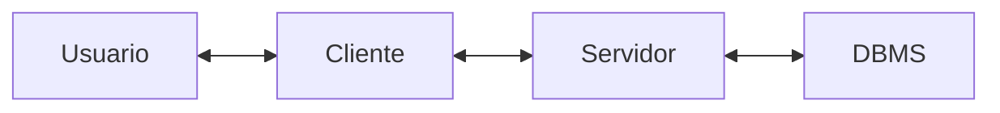
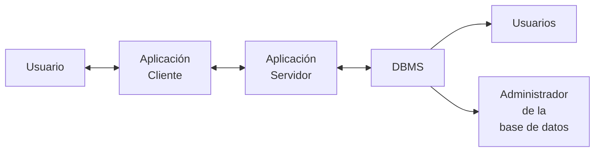

# Inyección SQL

1. [Introducción](#introducción)
	1. [Inyección SQL](#inyeccion-sql)
	2. [Casos de uso](#casos-de-uso)
	3. [Prevención](#prevencion)
2. [Introducción a bases de datos](#introduccion-a-bases-de-datos)
	1. [Database Management Systems](#database-management-systems)
	2. [Arquitectura](#arquitectura)
3. [Tipos de bases de datos](#tipos-de-bases-de-datos)
	1. [Bases de datos relacionales](#bases-de-datos-relacionales)
	2. [Bases de datos no relacionales](#bases-de-datos-no-relacionales)
4. [Introducción a MySQL](#introduccion-a-mysql)
	1. [Structured Query Language(SQL)](#structured-query-language)
	2. [Command Line](#command-line)
	3. [Crear base de datos](#crear-base-de-datos)
	4. [Tablas](#tablas)
5. [SQL Statements](#sql-statements)
	1. [INSERT Statement](#insert-statement)
	2. [SELECT Statement](#select-statement)
	3. [DROP Statement](#drop-statement)
	4. [ALTER Statement](#alter-statement)
	5. [UPDATE Statement](#update-statement)
6. [Resultados de consultas](#resultados-de-consulta)
	1. [Ordenar resultados](#ordenar-resultados)
	2. [Limitar resultados](#limitar-resultados)
	3. [Clausula WHERE](#clausula-where)
	4. [Clausula LIKE](#clausula-like)
7. [Operadores SQL](#operadores-sql)
	1. [Operador AND](#operador-and)
	2. [Operador OR](#operador-or)
	3. [Operador NOT](#operador-not)
	4. [Operadores de símbolos](#operadores-de-simbolos)
	5. [Operadores usados en consultas](#operadores-usados-en-consultas)
	6. [Precedencia de operadores múltiples](#precedencia-de-operadores-multiples)
8. [Introducción a las inyecciones SQL](#introduccion-a-las-inyecciones-sql)
	1. [Uso de SQL en aplicaciones web](#uso-de-sql-en-aplicaciones-web)
	2. [Qué es una inyección?](#que-es-una-inyeccion)
	3. [Inyeccion SQL](#inyección-sql)
	4. [Errores de sintaxis](#errores-de-sintaxis)
	5. [Tipos de inyecciones SQL](#tipos-de-inyecciones-sql)
9. [Alterando la lógica de una consulta](#alterando-la-logica-de-una-consulta)
	1. [Eludiendo la autenticación](#eludiendo-la-autenticacion)
	2. [Identificando SQLi ](#identificando-sqli)
	3. [Inyección OR](#inyeccion-or)
	4. [Eludiendo la autenticación con el operador OR](#eludiendo-la-autenticacion-con-el-operador-or)
10. [Usando comentarios](#usando-comentarios)
	1. [Comentarios](#comentarios)
	2. [Eludiendo autenticación con comentarios](#eludiendo-autenticacion-con-comentarios)
11. [Clausula UNION](#clausula-union)
	1. [UNION](#union)
	2. [Columnas pares](#columnas-pares)
	3. [Columnas impares](#columnas-impares)
12. [Inyección UNION](#inyeccion-union)
	1. [Detectar número de columnas](#detectar-número-de-columnas)
		1. [Usando ORDER BY](#usando-order-by)
		2. [Usando UNION](#usando-union)
	2. [Ubicación de la inyección](#ubicacion-de-la-inyeccion)
13. [Enumeración de la base de datos](#enumeracion-de-la-base-de-datos)
	1. [Identificando MySQL](#identificando-mysql)
	2. [Base de datos INFORMATION_SCHEMA](#base-de-datos-information_schema)
	3. [SCHEMATA](#schemata)
	4. [TABLES](#tables)
	5. [COLUMNS](#columns)
	6. [Datos](#datos)
14. [Leyendo archivos](#leyendo-archivos)
	1. [Privilegios](#privilegios)
	2. [LOAD_FILE](#load_file)
15. [Mitigando la inyección SQL](#mitigando-la-inyeccion-sql)
	1. [Sanitización del input del usuario](#sanitizacion-del-input-del-usuario)
	2. [Validación del input del usuario](#validacion-del-input-del-usuario)
	3. [Privilegios de usuario](#privilegios-de-usuario)
	4. [Web Application Firewall (WAF)](#web-application-firewall-(waf))
	5. [Consultar parametrizadas](#consultas-parametrizadas)

## Introducción
- La mayoría de aplicaciones web modernas usan una estructura de base de datos en el back-end.
- Tales bases de datos se usan para guardar y obtener datos relacionados a la aplicación web, ya sea contenido de la aplicación web como información y contenido del usuario.
- Para hacer que las aplicaciones web sean dinámicas, las aplicaciones web tiene que interactuar con las bases de datos en tiempo real.
- Una vez enviada una solicitud HTTP(S), el back-end de las aplicaciones web envía consultas a la base de datos para generar la respuesta.
- Las consultas pueden incluir información desde las consultas HTTP(S) u otra información relevante.



- Cuando la información suministrada es usada para construir una consulta a la base de datos, se la puede alterar para usarla con intenciones distintas de las que fue creada originalmente, proporcionando acceso para consultar la base de datos mediante un ataque conocido como inyección SQL (SQLi).
### Inyeccion SQL
- La inyección SQL ocurre cuando se ingresa un valor que modifica la consulta SQL final enviada a la base de datos de la aplicación web, permitiendo llevar a cabo consultas SQL no intencionadas.
- Inyectar código SQL y entonces alterar la lógica de la aplicación web modificando la consulta original o ejecutar una consulta completamente nueva.
- Inyectar código por fuera de los límites de los valores ingresados, así no se ejecuta como normalmente se hace.
- Inyectar un comilla simple `'` o doble `"` para escapar los limites de los valores ingresados e inyectar valores directamente en la consulta SQL.
- Una vez que se sabe que se puede inyectar, hay que buscar maneras de ejecutar diferentes consultas SQL.
- Se puede hacer usando código SQL para hacer funcionar una consulta que ejecute ambas consultas, la intencionada y la no intencionada.
- Para obtener la respuesta a la consulta, hay que interpretar la respuesta en el front-end.
### Casos de uso
- Una inyección SQL puede tener un impacto tremendo, especialmente si los privilegios en el servidor back-end y la base de datos son muy laxos.
- Primero se recupera información sensible/secreta que no debería ser visible, como usuarios y contraseñas o información de tarjetas de crédito lo que puede usarse para otros propósitos maliciosos.
- Las inyecciones SQL causan filtración de datos y contraseñas contra sitios web, los que se vuelven a usar para robar cuentas de usuarios, acceder a otros servicios, o llevar a cabo otras acciones maliciosas.
- Alterar la lógica intecionada de las aplicaciones web.
- Eludir el inicio de sesión sin ingresar datos válidos.
- Acceder a características que están bloqueadas para usuarios específicos, cómo paneles de administración.
- Leer y escribir archivos directamente en el servidor back-end, ubicando back doors en el servidor back-end y ganar control directorio sobre el, y eventualmente tomar control total de un sitio web.
### Prevencion
- Las inyecciones SQL son causadas por aplicaciones web mal codeadas o servidores back-end y bases de datos mal protegidas.
## Introduccion a bases de datos
- Las aplicaciones web usan bases de datos para guardar contenido e información relacionada a la aplicación web, como imágenes, archivos, posts, actualizaciones o datos de usuarios.
- Hay diferentes tipos de bases de datos, cada una con un tipo de uso particular.
### Database Management Systems
- Un sistema de gestión de bases de datos (DBMS) ayuda a crear, definir, alojar y administrar bases de datos.
- Tipos de DBMS: basado en archivos, DBMS relacional (RDBMS), NoSQL, basados en gráficos, clave/valor.
- Maneras de interactuar con una DBMS: herramientas de línea de comandos, interfaces gráficas, APIs (Application Programming Interfaces).

| Característica                     | Descripción                                                                                                                   |
| ---------------------------------- | ----------------------------------------------------------------------------------------------------------------------------- |
| Concurrencia                       | Asegura que las intecciones simultáneas sean exitosas sin corrupción o pérdida de datos.                                      |
| Consistencia                       | Aasegura que los datos son consistentes y válidos en toda la base de datos.                                                   |
| Seguridad                          | Controles de seguridad detallados a través de permisos y autenticación de usuarios.                                           |
| Confianza                          | Realiza copias de seguridad de las bases de datos y revertirlas a un estado anterior en caso de pérdida o violación de datos. |
| Lenguaje de consultas estructurado | SQL simplifica la interacción con la base de datos con una intuitiva sintaxis que soporta muchas operaciones.                 |

### Arquitectura


1. El usuario utiliza una aplicación web para ingresar datos.
2. Los datos son enviados al servidor a través de llamadas a una API u otras solicitudes.
3. El servidor interpreta estos eventos y los pone en una forma requerida por la DBMS.
4. El servidor usa librerías específicas y controladores basados en el tipo de DBMS para interactuar con las solicitudes.
5. La DBMS recibe las solicitudes y lleva a cabo las operaciones solicitadas que pueden incluir la inserción, obtención, eliminación o actualización de datos.
6. Después de procesar las solicitudes la DBMS retorna cualquier información solicitada o códigos de error.
## Tipos de bases de datos
- Las bases de datos en general se categorizan en:
	- Relacionales
	- No relacionales
- Las bases de datos relacionales usan SQL.
### Bases de datos relacionales
- Usan un esquema, una plantilla, para determinar la estructura de datos guardada en la base de datos.
- Las tablas se asocian con keys que proveen un resumen o acceso a una fila o columna específica cuando se necesita revisar datos específicos.
- Las tablas también se llaman entidades, y están relacionadas todas unas a otras.
- Para relacionar las tablas se requiere una RDBMS (Relational Database Management System).
- Se puede relacionar una key de **X** tabla a una key de **Y** tabla para obtener información de **X** tabla sin guardar toda la información de **Y** en **X**.
- Una tabla puede tener más de una key así como otra columna puede usarse como una key para relacionar otra tabla.

**Tabla X**

| id  | col2 | col3 | col4 |
| --- | ---- | ---- | ---- |
| 1   | x    | x    | x    |
| 2   | x    | x    | x    |
| 3   | x    | x    | x    |

**Tabla Y**

| id  | id_x | col3 | col4 |
| --- | ---- | ---- | ---- |
| 1   | 2    | x    | x    |
| 2   | 2    | x    | x    |
| 3   | 1    | x    | x    |

- La relación entre las tablas dentro de una base de datos se llama esquema.
### Bases de datos no relacionales
- También se llaman NoSQL, no usan tablas, filas, columnas, llaves primarias, relaciones o esquemas.
- Guarda la información usando distintos modelos de almacenamiento dependiendo del tipo de información almacenada.
- Debido a la falta de estructura son muy escalables y flexibles.
- Modelos de almacenamiento típicos:
	1. Clave/Valor
	2. Basada en documentos
	3. Wide-Column
	4. Gráficos

## Introduccion a MySQL
### Structured Query Language
- SQL puede llevar a cabo las siguientes acciones:
	- Obtener datos
	- Actualizar datos
	- Eliminar datos
	- Crear tablas y bases de datos
	- Agregar y eliminar usuarios
	- Asignar permisos a usuarios
### Command Line
- La herramienta `mysql` se usa para autenticarse e interactuar con la base de datos MySQL/MariaDB.
- La flag `-u` se usa para ingresar el usuario y la flag `-p` para ingresar la contraseña.
- La flag `-p` debería pasarse vacía, así no se pasa directamente en la línea de comandos y se guarda en texto plano en el archivo `bash_history`.

```bash
sudo mysql -u root -p
Enter password: 
Welcome to the MariaDB monitor.  Commands end with ; or \g.
Your MariaDB connection id is 40
Server version: 10.11.6-MariaDB-0+deb12u1 Debian 12

Copyright (c) 2000, 2018, Oracle, MariaDB Corporation Ab and others.

Type 'help;' or '\h' for help. Type '\c' to clear the current input statement.

MariaDB [(none)]>
```

- Para ingresar la contraseña directamente debe pasarse sin espacios entre la flag `-p` y la contraseña `-p<contraseña>`.
- Ver privilegios que se tiene `SHOW GRANTS FOR root@localhost;`, `SHOW GRANTS FOR CURRENT_USER();`:

```bash
MariaDB [(none)]> SHOW GRANTS FOR root@localhost;
+-----------------------------------------------------------------------------------------------------------------------------------------+
| Grants for root@localhost                                                                                                               |
+-----------------------------------------------------------------------------------------------------------------------------------------+
| GRANT ALL PRIVILEGES ON *.* TO `root`@`localhost` IDENTIFIED VIA mysql_native_password USING 'invalid' OR unix_socket WITH GRANT OPTION |
| GRANT PROXY ON ''@'%' TO 'root'@'localhost' WITH GRANT OPTION                                                                           |
+-----------------------------------------------------------------------------------------------------------------------------------------+
2 rows in set (0,000 sec)
```

```bash
MariaDB [(none)]> SHOW GRANTS FOR CURRENT_USER();
+-----------------------------------------------------------------------------------------------------------------------------------------+
| Grants for root@localhost                                                                                                               |
+-----------------------------------------------------------------------------------------------------------------------------------------+
| GRANT ALL PRIVILEGES ON *.* TO `root`@`localhost` IDENTIFIED VIA mysql_native_password USING 'invalid' OR unix_socket WITH GRANT OPTION |
| GRANT PROXY ON ''@'%' TO 'root'@'localhost' WITH GRANT OPTION                                                                           |
+-----------------------------------------------------------------------------------------------------------------------------------------+
2 rows in set (0,000 sec)
```

- Cuando no se especifica un host, se usa el servidor por defecto `localhost`.
- Especificar host remoto `-h` y puerto `-P`.
- El puerto por defecto de MySQL/MariaDB es 3306 pero puede configurarse.
### Crear base de datos
- Crear base de datos `CREATE DATABASE users;`:

```bash
MariaDB [(none)]> CREATE DATABASE users;
Query OK, 1 row affected (0,000 sec)
```

- Las consultas SQL se terminan con un punto y coma.
- Listar las bases de datos `SHOW DATABASES;`:

```bash
MariaDB [(none)]> SHOW DATABASES;
+--------------------+
| Database           |
+--------------------+
| information_schema |
| mysql              |
| performance_schema |
| sys                |
| users              |
+--------------------+
5 rows in set (0,000 sec)
```

- Cambiar a una base de datos específica `USE <base-de-datos>;`:

```bash
MariaDB [(none)]> USE users;
Database changed
```

- Las declaraciones SQL no distinguen entre mayúsculas y minúsculas.
- Los nombres de las bases de datos distinguen entre mayúsculas y minúsculas.
- Es buena práctica especificar declaraciones en mayúsculas.

### Tablas
- DBMS almacena en forma de tablas.
- Una tabla está formada por filas y columnas.
- La intersección de una fila y una columna se llama celda.
- Cada tabla se crea con un número fijo de columnas, cada columna es de un tipo de dato particular.
- El tipo de dato define el tipo de valor que se guarda en una columna.
- Tipos de datos: numbers, strings, date, time, y binary data. [Tipos de datos](https://dev.mysql.com/doc/refman/8.0/en/data-types.html)
- Puede haber tipos de datos específicos de DBMS.
- Crear tabla `CREATE TABLE`:

```bash
MariaDB [users]> CREATE TABLE logins (
    -> id INT,
    -> username VARCHAR(100),
    -> password VARCHAR(100),
    -> date_of_joining DATETIME
    -> );
Query OK, 0 rows affected (0,036 sec)
```

- Se especifica el nombre de la tabla y entre paréntesis cada columna por su nombre y su tipo de dato, cada columna separada por una coma.
- Listar tablas de la base de datos en uso `SHOW TABLES;`:

```bash
MariaDB [users]> SHOW TABLES;
+-----------------+
| Tables_in_users |
+-----------------+
| logins          |
+-----------------+
1 row in set (0,000 sec)
```

- Listar la estructura de una tabla con sus campos y tipos de datos `DESCRIBE logins;`:

```bash
MariaDB [users]> DESCRIBE logins;
+-----------------+--------------+------+-----+---------+-------+
| Field           | Type         | Null | Key | Default | Extra |
+-----------------+--------------+------+-----+---------+-------+
| id              | int(11)      | YES  |     | NULL    |       |
| username        | varchar(100) | YES  |     | NULL    |       |
| password        | varchar(100) | YES  |     | NULL    |       |
| date_of_joining | datetime     | YES  |     | NULL    |       |
+-----------------+--------------+------+-----+---------+-------+
4 rows in set (0,001 sec)
```

#### Propiedades de tabla
- [Propiedades](https://dev.mysql.com/doc/refman/8.0/en/create-table.html)
- Se pueden configurar propiedadses para una tabla y cada columna.
- `AUTO_INCREMENT` incrementa automáticamente en uno cada vez que un item se agrega a la tabla.
- `NOT NULL` asegura que la columna nunca se deje vacía.
- `UNIQUE` asegura que el item agregado es único.
- `DEFAULT` especifica el valor por defecto.
- `PRIMARY KEY` identifica de manera única cada registro en una tabla y se usa para relacionar tablas.

```bash
MariaDB [users]> CREATE TABLE logins ( id INT NOT NULL AUTO_INCREMENT, username VARCHAR(100) UNIQUE NOT NULL, password VARCHAR(100) NOT NULL, date_of_joining DATETIME DEFAULT NOW(), PRIMARY KEY (id) );
Query OK, 0 rows affected (0,032 sec)
```