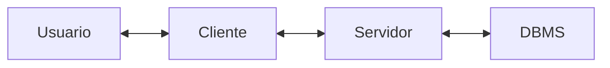

# Inyección SQL

1. [Introducción](#introducción)
	1. [Inyección SQL](#inyección-sql)
	2. [Casos de uso](#casos-de-uso)
2. [Introducción a bases de datos](#introducción-a-bases-de-datos)
	1. [Database Management Systems](#database-management-systems)
	2. [Arquitectura](#arquitectura)
3. [Tipos de bases de datos](#tipos-de-bases-de-datos)
	1. [Bases de datos relacionales](#bases-de-datos-relacionales)
	2. [Bases de datos no relacionales](#bases-de-datos-no-relacionales)
4. [Introducción a MySQL](#introducción-a-mysql)
	1. [Structured Query Language(SQL)](#structured-query-language(sql))
	2. [Command Line](#command-line)
	3. [Crear base de datos](#crear-base-de-datos)
	4. [Tablas](#tablas)
5. [SQL Statements](#sql-statements)
	1. [INSERT Statement](#insert-statement)
	2. [SELECT Statement](#select-statement)
	3. [DROP Statement](#drop-statement)
	4. [ALTER Statement](#alter-statement)
	5. [UPDATE Statement](#update-statement)
6. [Resultados de consultas](#resultados-de-consulta)
	1. [Ordenar resultados](#ordenar-resultados)
	2. [Limitar resultados](#limitar-resultados)
	3. [Clausula WHERE](#clausula-where)
	4. [Clausula LIKE](#clausula-like)
7. [Operadores SQL](#operadores-sql)
	1. [Operador AND](#operador-and)
	2. [Operador OR](#operador-or)
	3. [Operador NOT](#operador-not)
	4. [Operadores de símbolos](#operadores-de-símbolos)
	5. [Operadores usados en consultas](#operadores-usados-en-consultas)
	6. [Precedencia de operadores múltiples](#precedencia-de-operadores-múltiples)
8. [Introducción a las inyecciones SQL](#introducción-a-las-inyecciones-sql)
	1. [Uso de SQL en aplicaciones web](#uso-de-sql-en-aplicaciones-web)
	2. [Qué es una inyección?](#qué-es-una-inyección)
	3. [Inyección SQL](#inyección-sql)
	4. [Errores de sintaxis](#errores-de-sintaxis)
	5. [Tipos de inyecciones SQL](#tipos-de-inyecciones-sql)
9. [Alterando la lógica de una consulta](#alterando-la-lógica-de-una-consulta)
	1. [Eludiendo la autenticación](#eludiendo-la-autenticación)
	2. [Identificando SQLi ](#identificando-sqli)
	3. [Inyección OR](#inyección-or)
	4. [Eludiendo la autenticación con el operador OR](#eludiendo-la-autenticación-con-el-operador-or)
10. [Usando comentarios](#usando-comentarios)
	1. [Comentarios](#comentarios)
	2. [Eludiendo autenticación con comentarios](#eludiendo-autenticación-con-comentarios)
11. [Clausula UNION](#clausula-union)
	1. [UNION](#union)
	2. [Columnas pares](#columnas-pares)
	3. [Columnas impares](#columnas-impares)
12. [Inyección UNION](#inyección-union)
	1. [Detectar número de columnas](#detectar-número-de-columnas)
		1. [Usando ORDER BY](#usando-order-by)
		2. [Usando UNION](#usando-union)
	2. [Ubicación de la inyección](#ubicación-de-la-inyección)
13. [Enumeración de la base de datos](#enumeración-de-la-base-de-datos)
	1. [Identificando MySQL](#identificando-mysql)
	2. [Base de datos INFORMATION_SCHEMA](#base-de-datos-information_schema)
	3. [SCHEMATA](#schemata)
	4. [TABLES](#tables)
	5. [COLUMNS](#columns)
	6. [Datos](#datos)
14. [Leyendo archivos](#leyendo-archivos)
	1. [Privilegios](#privilegios)
	2. [LOAD_FILE](#load_file)
15. [Mitigando la inyección SQL](#mitigando-la-inyección-sql)
	1. [Sanitización del input del usuario](#sanitización-del-input-del-usuario)
	2. [Validación del input del usuario](#validación-del-input-del-usuario)
	3. [Privilegios de usuario](#privilegios-de-usuario)
	4. [Web Application Firewall (WAF)](#web-application-firewall-(waf))
	5. [Consultar parametrizadas](#consultas-parametrizadas)

## Introducción
- La mayoría de aplicaciones web modernas usan una estructura de base de datos en el back-end.
- Tales bases de datos se usan para guardar y obtener datos relacionados a la aplicación web, ya sea contenido de la aplicación web como información y contenido del usuario.
- Para hacer que las aplicaciones web sean dinámicas, las aplicaciones web tiene que interactuar con las bases de datos en tiempo real.
- Una vez que el usuario envía una solicitud HTTP(S), el back-end de las aplicaciones web envía las consultas a la base de datos para generar la respuesta.
- Las consultas pueden incluir información desde las consultas HTTP(S) u otra información relevante.

- Cuando la información suministrada es usada para construir una consulta a la base de datos, se puede alterar la consulta para usarla con intenciones distintas de las que fue creada originalmente, proporcionando acceso para consultar la base de datos mediante un ataque conocido como inyección SQL (SQLi).
### Inyección SQL
- La inyección SQL ocurre cuando se ingresa un valor que modifica la consulta SQL final enviada a la base de datos de la aplicación web, permitiendo llevar a cabo consultas SQL no intencionadas.
- Inyectar código SQL y entonces alterar la lógica de la aplicación web modificando la consulta original o ejecutar una consulta completamente nueva.
- Inyectar código por fuera de los límites de los valores ingresados por el usuario, así no se ejecuta como un simple usuario.
- Inyectar un comilla simple `'` o doble `"` para escapar los limites de los valores ingresados por el usuario e inyectar valores directamente en la consulta SQL.
- Una vez se puede inyectar, hay que buscar maneras de ejecutar diferentes consultas SQL.
- Se puede hacer usando código SQL para hacer funcionar una consulta que ejecute ambas consultas, la intencionada y la no intencionada.
- Para obtener la respuesta a la consulta, hay que interpretar la respuesta en el front-end.
### Casos de uso
