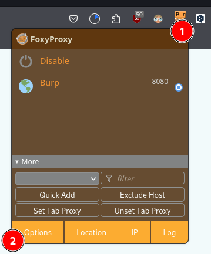
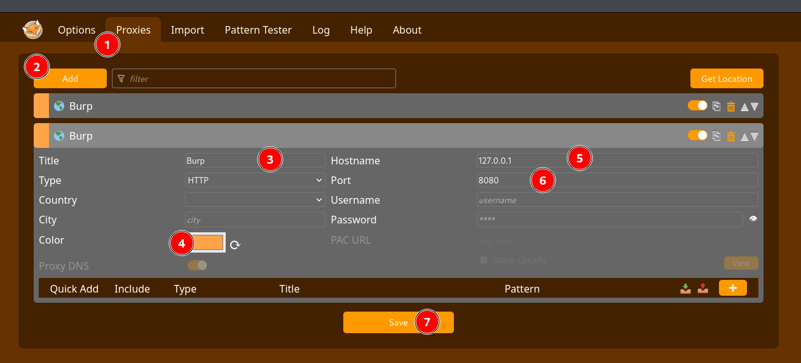
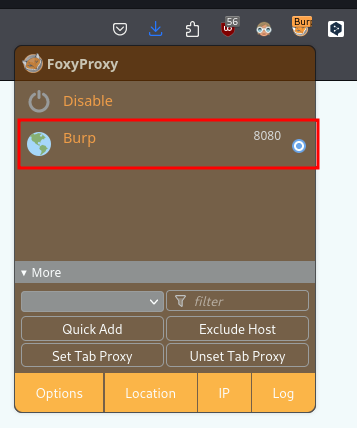
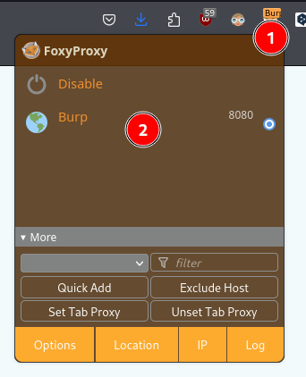
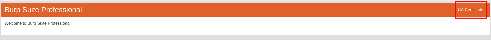
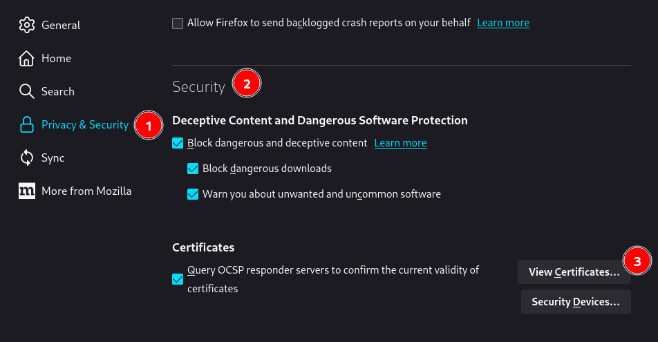
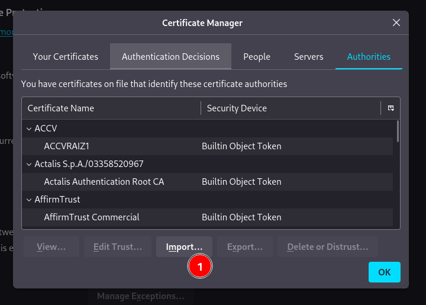
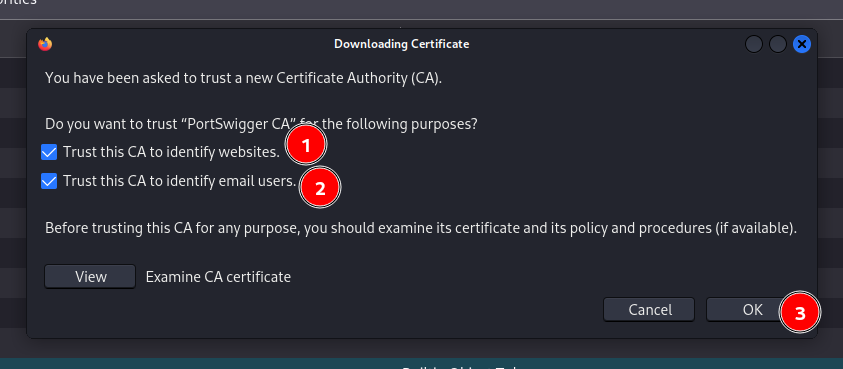
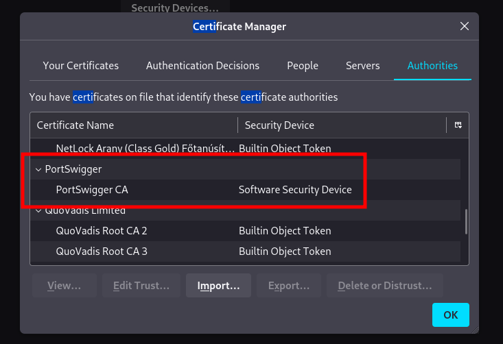

## Qué son los web proxies
🔹Capturan solicitudes y tráfico que pasa entre las aplicaciones y servidores back-end para manipularlas y testearlas. 
🔹Web proxies son herramientas especializadas que se configuran entre un navegador o aplicación móvil y un servidor back-end para capturar y ver las solicitudes que se transmiten entre ambos, actuando como una herramienta man-in-the-middle. 
🔹Mientas que otras aplicaciones de Network Sniffing como Wireshark operan analizando el tráfico local para que pasa a través de una red, los web proxies principalmente funcionan con puertos web tales como el HTTP/80 y HTTPS/443. 
🔹Una vez configurado el web proxie, podemos ver todas las solicitudes HTTP hechas por una aplicación y todas las respuestas enviadas por el servidor back-end. 
🔹Además, podemos interceptar una solicitud específica para modificar su información y ver como el servidor la maneja. 

## Usos de web proxies
- Scaneo de vulnerabilidades web
- Fuzzing web
- Web crawling
- Mapeo de aplicaciones web
- Análisis de solicitudes web
- Testeo de configuración web
- Revisión de código

## Web proxies
- Burp Suite
- ZAP

### Burp Suite
[Página oficial](https://portswigger.net/burp) 

🔹Características pagas:
- Scanner activo de aplicaciones web
- Burp Intrudes más rápido
- Capacidad de cargar extensiones Burp

🔹Podemos trabajar con un proyecto temporal o guardar el progreso si tenemos la versión pro. 
🔹Podemos configurar un tema oscuro. 
🔹Trae un navegador pre-configurado con configuraciones proxy y certificado CA pre-instalado. 
🔹En **Proxy > Intercept** podemos hacer click en **Open Browser** para abrir un navegador pre-configurado. 

#### Configurar el proxy
🔹Podemos configurar manualmente las preferencias de Firefox y configurar el proxy para usar el puerto en el que escucha el web proxy. 
🔹Si elegimos un puerto que ya está en uso, el proxy va a fallar y recibiremos un mensaje de error. 
🔹En vez de configurar manualmente el proxy, podemos usar una extensión de Firefox llamada [Foxy Proxy](https://addons.mozilla.org/en-US/firefox/addon/foxyproxy-standard/) para cambiar fácil y rápidamente el proxy de Firefox. 

#### Instalar certificado CA
🔹Si no se instala el certificado algún tráfico HTTPS podría no ser ruteado apropiadamente o tendríamos que aceptar cada vez que Firefox necesitara enviar solicitudes HTTPS. 
🔹Podemos instalar el certificado de Burp seleccionando Burp como nuestro proxy en Foxy Proxy: 

🔹Navegar a **http://burp** y descargar el certificado haciendo click en **CA Certificate** 

🔹Una vez descargado el certificado, podemos instalarlo dentro de Firefox navegando a las preferencias del navegador, en la sección **Privacy & Security** en el apartado **Security**, **View Certificates...**

### OWASP Zed Attack Proxy (ZAP)
[Página oficial](https://www.zaproxy.org/) 

🔹Es gratuita, de código abierto, mantenida por la comunidad y no tiene características pagas 
🔹Podemos crear proyectos temporales o guardar el progreso sin necesidad de pagar. 
🔹Podemos configurar un tema oscuro. 
🔹Podemos hacer click en el ícono del navegador **Firefox** al final de la barra superior para abrir el navegador pre-configurado. 