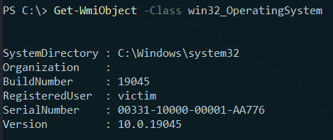
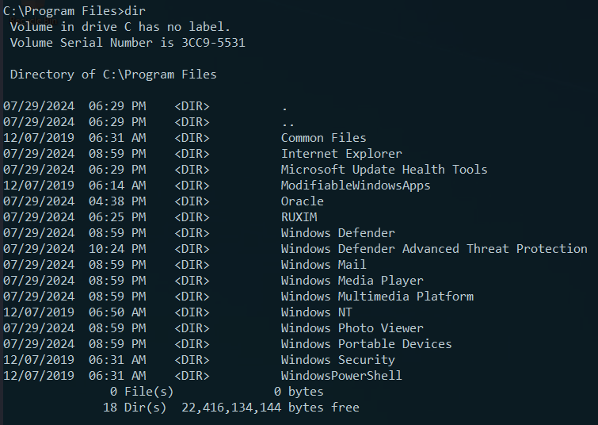
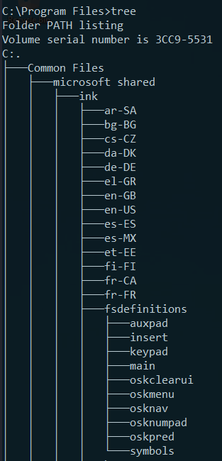
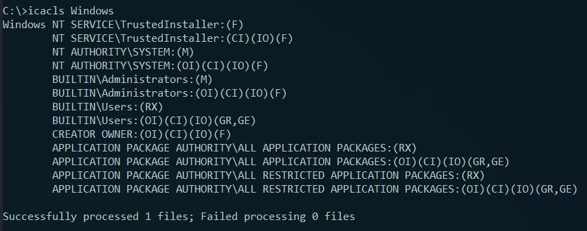
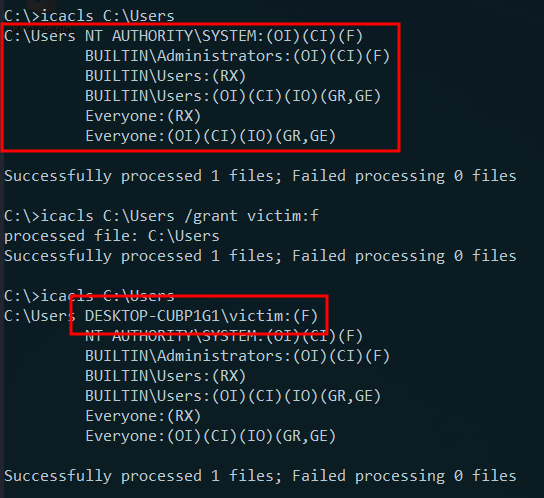
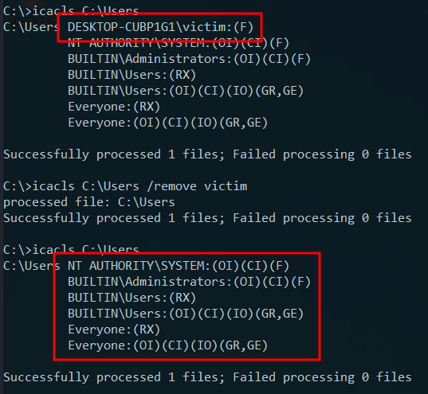
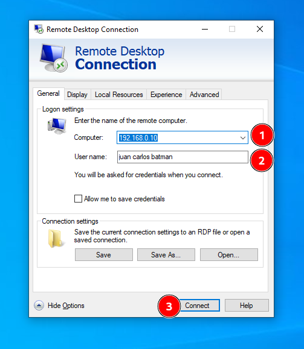
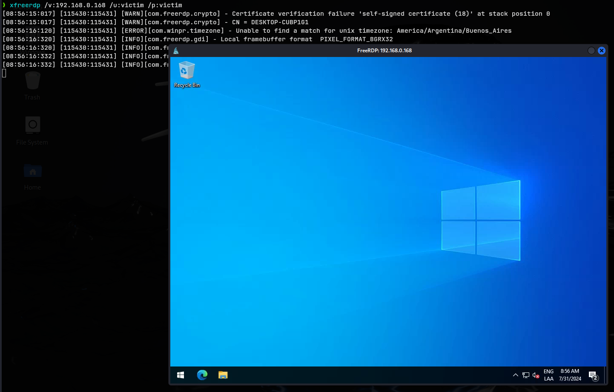

## Estructura del sistema operativo
🔹El directorio raíz de Windows normalmente es `C`.<br />
🔹El directorio raíz también conocido como la partition de arranque es donde el sistema operativo se instala.<br />
🔹A otros discos físicos o virtuales se les asigna otra letra.<br />
🔹La estructura del directorio de la partición de arranque es la siguiente:<br />

| Directorio                 | Función                                                                                                                                                                                                                                                                                                                                                                                                                                                                                                                                                                                                                  |
| -------------------------- | ------------------------------------------------------------------------------------------------------------------------------------------------------------------------------------------------------------------------------------------------------------------------------------------------------------------------------------------------------------------------------------------------------------------------------------------------------------------------------------------------------------------------------------------------------------------------------------------------------------------------ |
| Perflogs                   | Contiene registros del rendimiento de Windows.                                                                                                                                                                                                                                                                                                                                                                                                                                                                                                                                                                           |
| Program Files              | En sistemas de 32 bits, los programas de 16 y 32 bits se instalan ahí.                                                                                                                                                                                                                                                                                                                                                                                                                                                                                                                                                   |
| Program Files (x86)        | En sistemas de 64 bits, los programas de 16 y 32 bits se instalan ahí.                                                                                                                                                                                                                                                                                                                                                                                                                                                                                                                                                   |
| ProgramData                | Directorio oculto que contiene información esencial para la ejecución de ciertos programas.<br>La información es accesible por cualquier programa no importa que usuario lo está ejecutando.                                                                                                                                                                                                                                                                                                                                                                                                                             |
| Users                      | Contiene perfiles de cada usuario que inicia sesión en el sistema y contiene los directorios **Public** y **Default**.                                                                                                                                                                                                                                                                                                                                                                                                                                                                                                   |
| Default                    | Plantilla de perfil de usuario para los usuarios creados.<br>Los perfiles de usuarios creados se basan en esta plantilla.                                                                                                                                                                                                                                                                                                                                                                                                                                                                                                |
| Public                     | Directorio destinado para recursos compartidos.<br>Es accesible para todos los usuarios por defecto.<br>Se comparte sobre la red por defecto pero requiere una cuenta de red válida.                                                                                                                                                                                                                                                                                                                                                                                                                                     |
| AppData                    | Por cada usuario, información y configuración de aplicaciones se guardan en un subdirectorio oculto del usuario.<br>Este subdirectorio contiene 3 subdirectorios: Roaming, Local y LocalLow.<br>Roaming información independiente que sigue el perfil del usuario como por ejemplo diccionarios personalizados.<br>El directorio Local es específico a la computadora misma y nunca se sincroniza a través de la red.<br>El directorio LocalLow es similar al directorio Local pero tiene un nivel de integridad de datos bajo.<br>Sin embargo, puede ser usado por un navegador configurado en modo seguro o protegido. |
| Windows                    | Contiene la mayoría de archivos necesarios por el sistema operativo Windows.                                                                                                                                                                                                                                                                                                                                                                                                                                                                                                                                             |
| System, System32, SysWOW64 | Contiene todas las DLLs necesarias para las principales características de Windows y Windows API.<br>El sistema operativo buscar estos directorios cada vez que un programa solicita cargar una DLL sin especificar una ruta absoluta.                                                                                                                                                                                                                                                                                                                                                                                   |
| WinSxs                     | El WIndows Component Store contiene una copia de todos los componentes de Windows, actualizaciones y service packs.                                                                                                                                                                                                                                                                                                                                                                                                                                                                                                      |

> [!TIP]
> Obtener información del sistema operativo con `PowerShell`

```powershell
Get-WmiObject -Class win32_OperatingSystem | select Version,BuildNumber
```



## Sistema de archivos
🔹Hay 5 tipos de sistema de archivos:<br />
1. **FAT12**: No se usa más en sistema operativos Windows modernos.
2. **FAT16**: No se usa más en sistema operativos Windows modernos.
3. FAT32
4. NTFS
5. exFAT

**FAT**: File Allocation Table
🔹Se usa ampliamente en muchos tipos de dispositivos de almacenamiento:<br />
- Memorias USB
- Tarjetas SD
🔹Se usa para formatear discos duros.<br />
🔹El número 32 hace referencia al hecho que FAT32 usa 32 bits de datos para identificar conjuntos de datos en un dispositivo de almacenamiento.<br />

>[!TIP]
>Explorar el sistema de archivos con `cmd`

[Comando dir](https://learn.microsoft.com/en-us/windows-server/administration/windows-commands/dir)

```cmd
dir c:\ /a
```



[Comando tree](https://learn.microsoft.com/en-us/windows-server/administration/windows-commands/tree)

```cmd
tree
```



## Permisos
🔹El sistema de archivos NTFS tiene muchos permisos básicos y avanzados.
Algunos de los permisos claves son:<br />

| Tipo de permiso      | Descripción                                                                                                                         |
| -------------------- | ----------------------------------------------------------------------------------------------------------------------------------- |
| Full Control         | Permite leer, escribir, modificar y eliminar archivos y directorios.                                                                |
| Modify               | Permite leer, escribir y eliminar archivos y directorios.                                                                           |
| List Folder Contents | Permite ver y listar directorios y subdirectorios así como también ejecutar archivos.<br>Los directorios solo heredan este permiso. |
| Read and Execute     | Permite ver y listar archivos y subdirectorios así como también ejecutar archivos. Los archivos y directorios heredan este permiso. |
| Write                | Permite crear archivos en directorios y subdirectorios y escribir archivos.                                                         |
| Read                 | Permite ver y listar directorios y subdirectorios y ver el contenido de archivos.                                                   |
| Traverse Folder      | Permite o niega la posibilidad de atravesar directorios para alcanzar otros archivos o directorios.<br>                             |

🔹Los archivos y carpetas heredan permisos NTFS de su directorio padre para facilitar la administración, así los adminstradores no necesitan configurar explícitamente permisos para cada archivo y carpeta, ya que esto llevaría mucho tiempo.<br />
🔹Si los permisos no necesitan ser configurados explícitamente, un administrador puede deshabilitar la herencia de permisos para archivos y carpetas necesarios y después configurar permisos directamente para cada uno.<br />

### ICACLS (Integrity Control Access Control List)
[Documentación ICACLS](https://learn.microsoft.com/en-us/windows-server/administration/windows-commands/icacls)

🔹Los permisos NTFS en archivos y directorios en Windows se puede administrar usando el explorador de archivos en la pestaña seguridad.<br />
🔹También usando la herramienta **icacls** desde la línea de comandos (CMD).<br />

> [!TIP]
> Listar permisos NTFS

```cmd
icacls C:\
```



🔹El nivel de acceso a los recursos aparece después de cada usuario en el resultado mostrado en pantalla.<br />
🔹Las posibles configuraciones de herencia son:
- **CI**: container inherit
- **OI**: object inherit
- **IO**: inherit only
- **NP**: do not propagate inherit
- **I**: permission inherited from parent container
🔹Los permisos de acceso básicos son:
- **F**: full access
- **D**: delete access
- **N**: no access
- **RX**: read and execute access
- **R**: read-only access
- **W**: write-only access

🔹Se pueden otorgar y eliminar permisos desde la línea de comandos usando **icacls**.<br />

> [!TIP]
> Otorgar permiso de control total a un usuario determinado

```cmd
icacls c:\users /grant victim:f
```



> [!TIP]
> Eliminar permiso de control total a un usuario determinado

```cmd
icacls c:\users /remove victim
```



## Recursos compartidos
## Acceso remoto
🔹Algunas de las tecnologías más comunes de acceso remoto son:
- Virtual Private Networks (VPN)
- Secure Shell (SSH)
- File Transfer Protocol (FTP)
- Virtual Network Computing (VNC)
- Windows Remote Management (o PowerShell Remoting) (WinRM)
- Remote Desktop Protocol (RDP)
### Remote Desktop Protocol (RDP)
🔹**RDP** usa una arquitectura client/servidor donde la aplicación del lado del cliente se usa para especificar la dirección IP objetivo o el hostname a través de una red en donde RDP está habilitado.<br />
🔹La computadora objetivo donde el acceso remoto por RDP está habilitado se considera el servidor.<br />
🔹El puerto por defecto donde RDP escucha es el **3389**.<br />
🔹La dirección IP se usa como un identificador lógico para una computadora en una red y un puerto lógico es un identificador asignado a una aplicación.<br />
🔹Si nos conectamos a una máquina Windows desde una máquina Windows se puede usar la aplicación incorporada **Remote Desktop Connection**.<br />



🔹Para que esto funcione el acceso remoto tiene que estar permitido en la máquina Windows objetivo.<br />
🔹Por defecto el acceso remoto no está permitido en el sistema operativo Windows.<br />
🔹Remote Desktop Connection permite guardar perfiles.<br />
🔹Buscar archivos **.rdp**.<br />
### xfreerdp
[Página oficial de xfreerdp](https://www.freerdp.com/)

🔹Desde una máquina Linux se puede usar una herramienta llamada **xfreerdp** para acceder de manera remota a una máquina Windows.<br />

```bash
xfreerdp /v:<direccion-ip> /u:<usuario> /p:<contraseña>
```



## Servicios
## Procesos
## Sesiones de Windows
